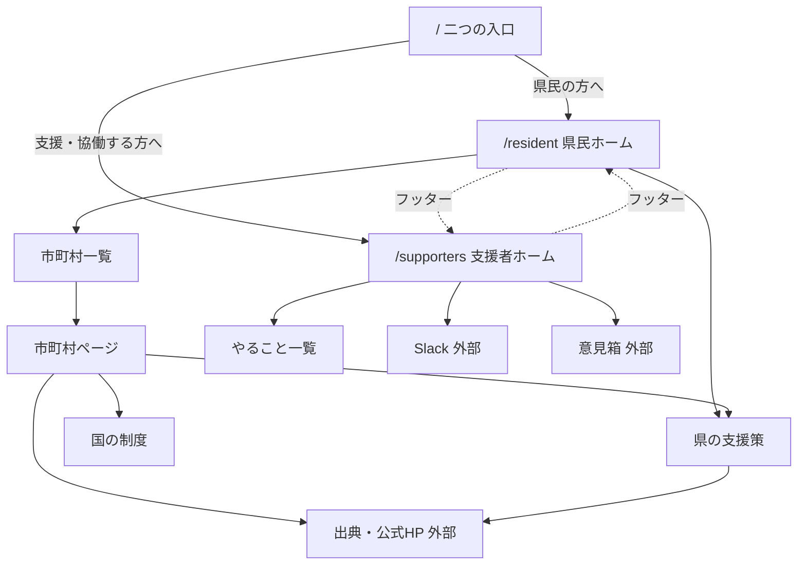
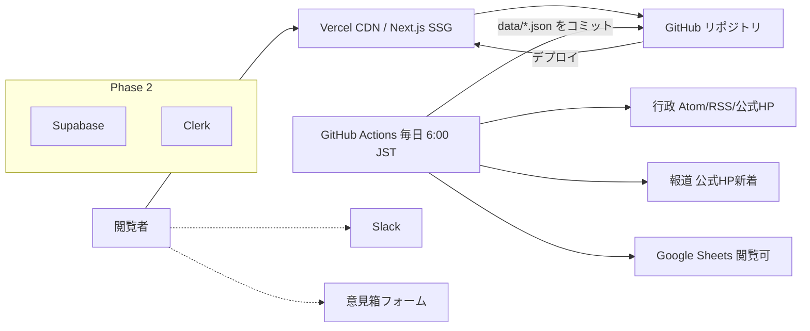
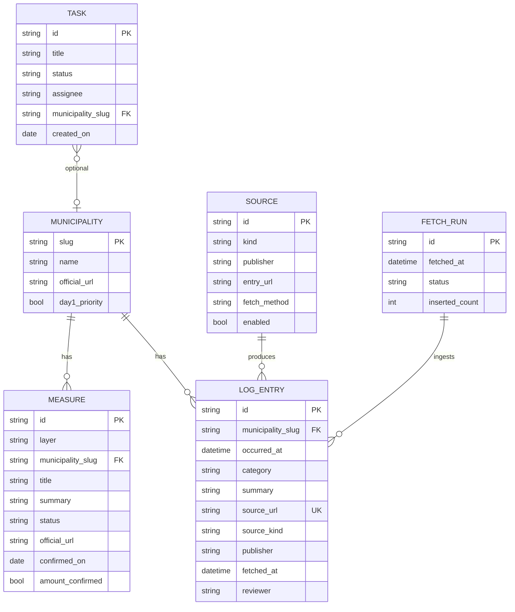
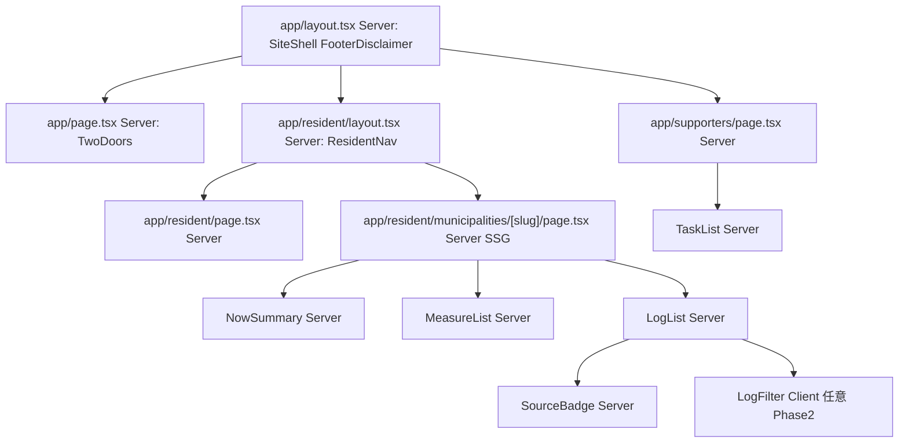

# 要件定義書

文書: `docs/output/detailed_requirements_specification.md`  
根拠: `docs/output/system_requirements.md`、`docs/input/*`  
テンプレート: `docs/template/Requirements_Specification_Template.md`

`(仮定)` はシステム要件の A1〜A12 および本詳細化で置いた推論である。

---

## 1. プロジェクト概要

### 1.1 プロジェクト名

- **令和8年8月千葉豪雨 CTZC 復興支援ポータル（仮称）開発プロジェクト**

### 1.2 背景・目的

- **背景**: 令和8年8月の千葉豪雨を受け、公式発表は最新で上書きされ被害の経過が残らない。国・県・市町村の支援策は分散し、生活再建（罹災証明の前後、応急修理か応急仮設か）の段取りが見えにくい。CTZC 有志の意思は Slack で流れ、何を拾えばよいかが見えない。
- **目的**:
  - 県民が自分の市町村ページで、被害ログ（過去〜現在）といまの支援策にたどり着ける
  - 支援者が許可リスト整備・誤りの訂正に手を挙げられる
  - トップで県民と支援者が迷わず分かれる
  - 行政・報道の公開情報を毎日 6:00 JST に自動収集し、履歴として残す

定量目標（いずれも `(仮定)`・仮置き）: 公開後2週間で Slack 新規 5 名・やることへの反応 1 件以上。初日ログ対象（レベル5対象および流山市）に出典付きログがある。最終取得日時が 24 時間以内。

### 1.3 システムのビジョン / スコープ

- **ビジョン**: 行政サイトを置き換えず補完する。県民には履歴付きの状況と支援策、支援者には協働の作業場を、有志運営である旨を明示したまま届ける。
- **スコープ（含む）**: Web（モバイル第一）。二入口。全市町村ページ枠。日次自動収集。ログ・支援策3層・生活再建の段取り。支援者ホーム、Slack リンク、やること一覧、意見箱。運用シート。
- **スコープ（含まない）**: 認証、サイト内 CMS、Supabase（MVP）、QA ナビ、地図、多言語、罹災調査システム、報道全文転載、Yahoo/NHK 公式 RSS の再配信、収益化。

---

## 2. ビジネス要件

### 2.1 ビジネスモデル情報（任意）

**リーンキャンバス（要約）**

| 項目 | 内容 |
|------|------|
| 課題 | 被害経過が残らない。支援策が分散。生活再建の段取りが見えない。有志の作業が見えない |
| 顧客 | 県民・被災者。CTZC と外部有志 |
| 価値提案 | 行政・報道を1日1回集め、行政／報道を区別して履歴と「いま申請できること」を見せる。有志は許可リストと例外に回る |
| チャネル | サイト、Slack、SNS 告知 |
| 収益 | なし（非営利） |
| コスト | ドメイン・ホスティングは無料枠。人件費は無償 |
| 主要指標 | 手挙げ、ログが載った市町村数、最終取得日時 |
| 優位性 | 千葉県スコープの既存コミュニティ、公開事例（袖ケ浦）の拡張、日次履歴 |

**7Powers 視点**: 営利の堀は狙わない。カウンターポジションは「行政より速く、履歴を残す有志サイト」。ネットワーク効果は協働編集が回り始めてから。模倣されやすいこと自体が社会的価値。

**市場規模**: 非営利のため売上予測は置かない。閲覧ピークは報道時に数千〜数万 PV になり得る `(仮定 A1)`。

### 2.2 成果指標（KPI/KGI）

| 指標 | 目安 | 期限 |
|------|------|------|
| KGI | 二入口のサイトとして、県民がログと支援策を見られ、自動更新が生きている | MVP 公開時 |
| KPI | Slack 新規参加者 | 2週間で 5 名 `(仮定)` |
| KPI | やることへの手挙げまたは指摘 | 2週間で 1 件以上 |
| KPI | 出典付きログがある市町村 | 初日対象（レベル5＋流山市） |
| KPI | 最終取得日時 | 公開後、平常時は 24 時間以内 |

### 2.3 ビジネス上の制約

- 予算なし。月額 0 円目標（Vercel Hobby、GitHub Actions、Sheets、Forms）
- 運営は当面 1 名。即時公開
- 個人情報をサイト・シートに溜めない
- 制度の金額・日数は公式確認前に出さない
- 個人名・特定行政の内部情報は出さない
- 袖ケ浦ソース再利用は作成後に確認

---

## 3. ユーザー要件

### 3.1 ユーザープロファイル / ペルソナ

**ペルソナ1: 鈴木さん（県民・被災者）**

- 被災地域在住。年齢は幅広く高齢者を含む。スマートフォン、通信が不安定なことがある
- 課題: 公式が上書きされる。支援策が分散。罹災証明の前に何をすればよいか分からない
- 利用: 避難先や自宅で「自分の市のいま」を見る。申請は公式へ

**ペルソナ2: 佐藤さん（CTZC メンバー）**

- 千葉在住の会社員エンジニア／デザイナー。Slack 参加済み
- 課題: 何を拾えばよいか分からない。Slack が流れる
- 利用: 仕事終わりに支援者面を開き、許可リストや誤紐づけの作業に手を挙げる

### 3.2 ユーザーストーリー

1. 被災した住民として、自分の市町村の被害ログといまの支援策だけを見たい。なぜなら Slack やボランティア募集ではなく手続きと経緯が必要だから。
2. 被災した住民として、行政の発表と報道を区別して辿りたい。なぜなら受付状態は行政が正しく、報道は速報だから。
3. CTZC メンバーとして、許可リストに市の公式 URL を足す／誤紐づけを直す仕事を見つけて手を挙げたい。なぜなら全部を手で拾うのは続かないから。
4. Slack に入っていない有志として、意見箱からサイトへの指摘を送りたい。なぜなら申請窓口ではなく改善の入口が欲しいから。
5. 県民として、最終取得日時を見て情報が止まっていないか知りたい。なぜなら更新停止した災害サイトを信じたくないから。

### 3.3 MVP（Minimum Viable Product）の定義

- **実装する範囲**: 二入口、県民ホーム、全市町村枠、市町村ページ（いま／ログ／支援策／段取り）、県・国の支援策参照、日次収集（6:00 JST）、出典区分、最終取得日時、支援者ホーム、Slack、やること、意見箱、フッター注記
- **初日の中身**: レベル5対象および流山市を厚くする。他は枠＋公式リンク
- **ゴール**: 入口が分かれる。自動更新が回る。運営者以外の反応がある
- **含めない**: 認証、DB（Supabase）、QA ナビ、地図、サイト内編集、全文転載

---

## 4. 機能要件

### 4.1 機能一覧 / MoSCoW 分類

| 機能 ID | 機能名 | 要約 | Must/Should/Could/Won't | MVP 対象 |
| ------- | ------ | ---- | ----------------------- | -------- |
| F-000 | 二つの入口 | 県民／支援者を同列に置く | Must | Yes |
| F-001 | 共通フッター・最終取得日時 | 有志運営、申請は公式へ、最終取得日時 | Must | Yes |
| F-010 | 県民向けホーム | 市町村から探す、県の支援策、公式リンク | Must | Yes |
| F-011 | 市町村一覧・個別ページ枠 | 全市町村。空でも公式 HP へ | Must | Yes |
| F-012 | 被害状況ログ | 時系列。行政／報道。上書きしない | Must | Yes |
| F-013 | 支援策3層 | 国・県・市町村。受付状態。行政優先 | Must | Yes |
| F-014 | 生活再建の段取り | 共通の型。いま／これから | Must | Yes |
| F-015 | 日次自動収集 | 6:00 JST。許可リスト。失敗時は前回維持 | Must | Yes |
| F-020 | 支援者向けホーム | 役割説明、Slack を主ボタン | Must | Yes |
| F-021 | やること一覧 | 募集中／進行中／完了 | Must | Yes |
| F-022 | 意見箱 | 外部フォーム。申請窓口ではない | Must | Yes |
| F-023 | 運用シート連携 | 許可リスト・やること・訂正 | Must | Yes |
| F-030 | ログの種別フィルタ | ライフラインだけ見る等 | Should | No |
| F-031 | いまのフェーズ表示 | 災害救助法・罹災証明の受付 | Should | No |
| F-032 | QA 型ナビゲーター | SaigaiAId 拡張 | Should | No |
| F-040 | サイト内編集・ログイン | Clerk / Supabase Auth | Could | No |
| F-041 | 地図ダッシュボード | | Could | No |
| F-042 | 多言語 | | Could | No |
| F-050 | 認証（Clerk） | MVP 閲覧専用 | Won't | No |
| F-051 | 罹災調査システム | 行政の領域 | Won't | No |
| F-052 | Yahoo/NHK 公式 RSS 再配信 | 利用条件 | Won't | No |

### 4.2 機能詳細仕様

#### 4.2.1 `<機能 ID: F-000 二つの入口>`

- **概要**: トップで県民向けと支援者向けを同列に分け、以降の主操作を混線させない
- **ユースケース**: 初めてサイトを開いた人が、自分の役割を選ぶ
- **前提条件**: 静的ページがデプロイされている
- **正常系フロー**:
  1. `/` を開く
  2. 「県民の方へ（被害の経過と、いまの支援策）」「支援・協働する方へ（情報共有と参加）」を見る
  3. 県民を選ぶ → `/resident`。支援者を選ぶ → `/supporters`
- **例外系フロー**:
  - 深い URL で直リンクした場合も、ヘッダーで今いる面が分かり、フッターでもう一方へ戻れる
- **UI 要件**:
  - 二つの入口は同じ大きさ。色だけに頼らない
  - 県民面の主ボタンに Slack を置かない
  - 支援者面の主ボタンに罹災証明の申請を置かない
- **非機能面注意**: LCP 3 秒以内。装飾画像なし

#### 4.2.2 `<機能 ID: F-011 / F-012 / F-013 / F-014 市町村ページ>`

- **概要**: 全市町村に同一テンプレートのページを持つ。ログ・いまの支援策・段取りを出す
- **ユースケース**: 鈴木さんが自分の市を選び、いまとこれまでを見る
- **前提条件**: `municipalities` マスタがある。ログは日次ジョブまたはシート訂正済み
- **正常系フロー**:
  1. `/resident/municipalities` から自治体を選ぶ（または検索）
  2. `/resident/municipalities/[slug]` を開く
  3. 上部に「いま」（最新ログと一致）、最終取得日時、出典区分
  4. いまの支援策（受付中が上。行政優先）
  5. 被害ログ（新しい順。過去も残る）
  6. 生活再建の段取り（いま申請できる／これから）
  7. 県・国レイヤーへのリンク。公式 HP
  8. カードから出典 URL へ遷移する
- **例外系フロー**:
  - ログ 0 件: 「準備中」＋公式 HP。空白にしない
  - ジョブ失敗: 前回データ。最終取得日時は古いまま、または失敗を明示
  - 出典 URL なし: 公開しない
- **UI 要件**:
  - 行政／報道は文字ラベル（必要なら色も）
  - 受付中／準備中／終了も文字併記
  - 「必ず受けられる」と書かない
- **非機能面注意**: SSG（`generateStaticParams` で 54 件）。本文は要約のみ

#### 4.2.3 `<機能 ID: F-015 日次自動収集>`

- **概要**: 許可リストの行政・報道から毎日 6:00 JST に見出し・要約・URL を取り、ログへ追記して再デプロイする
- **ユースケース**: 無人で履歴が増える。佐藤さんは例外だけ直す
- **前提条件**: 運用シートがリンク閲覧可。GitHub Actions がリポジトリに書き戻せる（または成果物をデプロイできる）`(仮定: GITHUB_TOKEN で data コミット可)`
- **正常系フロー**:
  1. cron `0 21 * * *` UTC で workflow 起動
  2. シート（または `source-allowlist.md` のスナップショット）から許可リストを読む
  3. Atom/RSS をパース。HTML 入口は許可ドメインの新着から title と URL のみ
  4. 報道・全国はキーワード（千葉 かつ 豪雨等）で絞る
  5. 市町村公式はその slug に紐づける。不明は県共通
  6. 同一 `source_url` はスキップ
  7. `data/logs.json` 等へ追記。`fetched_at` を更新
  8. ビルドして Vercel に出す
- **例外系フロー**:
  - 取得失敗・非 200: そのソースをスキップし、他は続ける。全体失敗なら前回データでサイト維持、`fetched_at` 非更新
  - Yahoo/NHK 公式 RSS URL がリストにあっても処理しない
  - 本文 HTML を保存しない
- **UI 要件**: 県民面に最終取得日時。失敗が続くときは支援者面で分かるようにする `(仮定: サイト上の1行で足りる)`
- **非機能面注意**: 1 日 1 回に抑える。`robots.txt` と利用条件を尊重。全文転載しない

---

## 5. 非機能要件

### 5.1 パフォーマンス要件

- **レスポンス時間**: 主要画面 LCP 目安 3 秒以内（4G 相当）`(仮定 A1)`
- **同時接続数**: 動的オリジンに依存しない。CDN 上の静的ファイル。ピーク数千〜数万 PV `(仮定)`
- **処理量**: 閲覧は静的。収集は 1 日 1 回、許可リスト数十ソース

### 5.2 セキュリティ要件

- **認証／認可**: MVP はなし。Clerk は Phase 2（Won't for MVP）
- **データ保護**: HTTPS（Vercel）。意見箱に氏名・住所・被害詳細を必須にしない
- **監査ログ**: Git のコミット履歴が収集結果の履歴。シート編集は Google の版
- **コンプライアンス**: 個人情報保護。報道は見出し・リンクのみ。有志運営を全ページに明示

### 5.3 可用性・信頼性

- **稼働率**: Vercel / GitHub の公開 SLA に乗る `(仮定: 99.9% を自前では保証しない)`
- **障害時**: 収集失敗時は前回の静的成果を出す。公式リンク集は残す
- **フェイルオーバー**: マルチリージョンは対象外。必要なら Cloudflare Pages へ移す

### 5.4 ユーザビリティ / UI・UX

- **アクセシビリティ**: 本文大きめ。コントラスト確保。状態を色だけにしない。WCAG 2.1 AA を目標 `(仮定)`
- **多言語**: MVP は日本語のみ
- **操作導線**: トップで1回選ぶ。県民の主操作は「市町村から探す」。支援者の主操作は Slack

#### デザインコンセプト

- 実用一辺倒。開いた瞬間に入口が分かる
- トーン: 落ち着いた、公式ではないが信頼できる
- 参考: 袖ケ浦ナビ、能登版、東京都コロナ対策サイト

**カラー（提案・仮定）**

| 用途 | 値 |
|------|-----|
| 背景 | `#FFFFFF` / 薄いグレー `#F4F5F7` |
| 本文 | `#1A1A1A` |
| アクセント（リンク・主ボタン） | `#0B5CAB` |
| 行政ラベル | `#0B5CAB` 背景薄＋「行政」文字 |
| 報道ラベル | `#8A5A00` 背景薄＋「報道」文字 |
| 受付中 | 緑系＋文字「受付中」 |
| 準備中 | グレー＋文字 |
| 終了 | グレーアウト＋文字 |

**タイポグラフィ（提案・仮定）**

- システムフォント優先（`system-ui`, 游ゴシック, ヒラギノ）でウェブフォントを増やさない
- 本文 16px 以上、行間 1.6

#### 画面一覧

| ID | パス | 面 | 目的 |
|----|------|----|------|
| S-00 | `/` | 共通 | 二入口 |
| S-10 | `/resident` | 県民 | ホーム |
| S-11 | `/resident/municipalities` | 県民 | 一覧 |
| S-12 | `/resident/municipalities/[slug]` | 県民 | 個別 |
| S-13 | `/resident/prefecture` | 県民 | 県の支援策 |
| S-14 | `/resident/national` | 県民 | 国の制度 |
| S-20 | `/supporters` | 支援者 | ホーム |
| S-21 | `/supporters/tasks` | 支援者 | やること |
| S-22 | 外部 | 支援者 | Slack / 意見箱フォーム |

#### 画面遷移図



#### ワイヤーフレーム

**S-00 トップ**

```
+------------------------------------------+
| ロゴ  CTZC 千葉豪雨ポータル    最終取得 |
+------------------------------------------+
| 有志運営です。行政の公式発表ではありません |
| 申請・問い合わせは各公式窓口へ             |
+--------------------+---------------------+
| [県民の方へ]       | [支援・協働する方へ] |
| 被害の経過と       | 情報共有と参加       |
| いまの支援策       |                     |
+--------------------+---------------------+
| フッター: 公式ではない / Slack / 意見箱   |
+------------------------------------------+
```

**S-12 市町村ページ**

```
+------------------------------------------+
| 県民 | 市町村一覧 | 最終取得: 2026-08-14 06:00 |
+------------------------------------------+
| 千葉市                                   |
| いま: （最新ログ1〜2文） [行政] 8/14 05:00 |
| 公式HP →                                 |
+------------------------------------------+
| いま受けられる支援策（受付中が上）         |
| ・罹災証明書 ... [受付中] [行政] 出典     |
+------------------------------------------+
| 被害状況ログ（新しい順）                   |
| 08-14 05:00 [行政] 千葉市  ... 出典       |
| 08-13 21:00 [報道] ○○新聞 ... 出典       |
+------------------------------------------+
| 生活再建の段取り                           |
| 避難 → 救助法 → 調査 → 罹災証明 → 修理/仮設 |
| いま申請できる / これから                  |
+------------------------------------------+
```

**S-20 支援者ホーム**

```
+------------------------------------------+
| 支援者 | やること | Slack が主ボタン       |
+------------------------------------------+
| 役割: 自動収集を支え、誤りを直す           |
| [Slack に参加する]                         |
| [やること一覧]  [意見箱]                   |
| ※ ここは申請窓口ではありません            |
+------------------------------------------+
```

### 5.5 スケーラビリティ

- 閲覧は CDN。収集は 1 日 1 回
- 突発アクセスは静的配信で吸収
- データ量が増えたら Phase 2 で Supabase を再評価

---

## 6. インテグレーション要件

### 6.1 外部サービス / SaaS 連携

| 種別 | 採用（MVP） | 備考 |
|------|-------------|------|
| 認証 | なし | Clerk は Phase 2 |
| DB | なし（JSON/シート） | Supabase は Phase 2 |
| ホスティング | Vercel | |
| CI / 収集 | GitHub Actions | cron `0 21 * * *` |
| 許可リスト・やること | [Google スプレッドシート](https://docs.google.com/spreadsheets/d/1_dHZHMLvTx6iTCzwvbw6U9cTHjTIH_6RlEob81Ng7KM/edit?usp=sharing) | リンク閲覧可、編集招待制 |
| 意見箱 | Google フォーム等 | 個人情報を必須にしない |
| 連絡 | Slack | リンクのみ。API なし |
| 決済 | なし | |
| AI | なし（MVP） | 要約をモデルに投げない `(仮定: 転載・誤要約リスク)` |
| 気象庁 Atom | extra_l.xml | 許可リスト |
| 消防庁 RSS | disaster/info/index.xml | |

### 6.2 API 仕様

公開サイトは HTML の SSG が主。実装用に次を置く。

**A. 公開 JSON（ビルド成果。認証なし）**

`GET /data/meta.json`

```json
{
  "fetched_at": "2026-08-14T06:00:00+09:00",
  "fetch_status": "ok"
}
```

`GET /data/logs.json?municipality=chiba` （実装は静的ファイル分割でも可）

レスポンス例:

```json
{
  "items": [
    {
      "id": "log_20260814_chiba_1",
      "municipality_slug": "chiba",
      "occurred_at": "2026-08-14T05:00:00+09:00",
      "category": "lifeline",
      "summary": "公式発表の要約1〜3文",
      "source_url": "https://www.city.chiba.jp/...",
      "source_kind": "admin",
      "publisher": "千葉市",
      "fetched_at": "2026-08-14T06:00:00+09:00"
    }
  ]
}
```

**B. 収集ジョブ（公開 REST ではない）**

- 起動: GitHub Actions `workflow_dispatch` および schedule
- 処理: 許可リスト取得 → 収集 → `data/*.json` 更新 → デプロイ
- 手動再実行: Actions の Run workflow（緊急時）`(仮定: 中優先の未決を「手動可」として実装)`

**C. シート読み取り**

- 方法: 公開 CSV（`/export?format=csv&gid=`）または gviz `(仮定: リンク閲覧可のため CSV エクスポートが使える)`
- 認証ヘッダなし

MVP で `POST /api/register` 等のユーザー API は作らない。

### 6.3 データ連携要件

- **形式**: JSON（サイト）、CSV（シート）
- **頻度**: 収集は日次バッチ。シート訂正は次回ビルドまたは手動 workflow
- **再送**: ソース単位でスキップし、ジョブ全体は可能な限り成功させる。全失敗時は前回 JSON を残す

---

## 7. 技術選定とアーキテクチャ

### 7.1 技術スタックの要約

- **フロントエンド**: Next.js (App Router), React, TypeScript, Tailwind CSS `(仮定: ユーティリティ CSS)`
- **バックエンド**: 常時 API なし。収集は GitHub Actions
- **データベース**: MVP はリポジトリ内 JSON + シート。Supabase は Phase 2
- **認証**: MVP なし。Clerk は Phase 2
- **ホスティング**: Vercel

### 7.2 アーキテクチャ概要

- **UI 層**: Next.js SSG
- **データ層**: `data/*.json`、Sheets
- **収集層**: Actions cron
- **外部**: 行政 Atom/RSS、公式 HTML 新着、Slack、Forms
- **Phase 2（点線）**: Supabase、Clerk

### 7.3 システム構成図



### 7.4 論理データモデル（MVP は JSON / シート、Phase 2 で RDB）



#### テーブル定義（主要）

**MUNICIPALITY**

| カラム | 型 | 制約 |
|--------|-----|------|
| slug | text | PK。例 `chiba`, `nagareyama` |
| name | text | NOT NULL |
| official_url | text | NOT NULL |
| day1_priority | boolean | レベル5＋流山 |

**LOG_ENTRY**

| カラム | 型 | 制約 |
|--------|-----|------|
| id | text | PK |
| municipality_slug | text | FK。県共通は `chiba-pref` `(仮定)` |
| occurred_at | timestamptz | NOT NULL |
| category | text | housing / evac / lifeline / hq / measure / other |
| summary | text | 1〜3文。NOT NULL |
| source_url | text | UNIQUE, NOT NULL |
| source_kind | text | `admin` \| `press` |
| publisher | text | NOT NULL |
| fetched_at | timestamptz | NOT NULL |
| reviewer | text | nullable |

**MEASURE**

| カラム | 型 | 制約 |
|--------|-----|------|
| layer | text | `national` \| `prefecture` \| `municipality` |
| status | text | `open` \| `upcoming` \| `closed` |
| amount_confirmed | boolean | false なら金額を出さない |
| official_url | text | NOT NULL |

**SOURCE**（シート「許可リスト」）

| カラム | 型 | 制約 |
|--------|-----|------|
| id | text | `A-JMA-EXTRA` 等 |
| fetch_method | text | `atom` \| `rss` \| `html_index` |
| enabled | boolean | Yahoo/NHK RSS は false 固定 |

### 7.5 コンポーネント階層（App Router）



**主要コンポーネント**

1. `TwoDoors`（Server）  
   - Props: なし（文言は定数）  
   - 状態: なし  
   - Client にしない

2. `LogList`（Server）  
   - Props: `{ entries: LogEntry[] }`  
   ```ts
   type SourceKind = "admin" | "press";
   type LogEntry = {
     id: string;
     occurredAt: string;
     category: string;
     summary: string;
     sourceUrl: string;
     sourceKind: SourceKind;
     publisher: string;
   };
   ```  
   - 状態: MVP はフィルタなし。Should のフィルタだけ `LogFilter` を Client に切る

3. `TaskList`（Server）  
   - Props: `{ tasks: Task[] }`  
   - データはビルド時にシート CSV から読む  
   - 状態: なし

方針: 閲覧は Server Components と SSG。Client はフィルタ・アコーディオンなど最小。グローバル状態（Jotai/Zustand）は MVP で使わない。

---

## 8. 開発プロセス / スケジュール

### 8.1 開発モデル・プロセス

- アジャイル / イテレーティブ。MVP を即時出し、許可リストとログ品質を回す
- 要件変更は GitHub Issue / PR。本ファイルと `system_requirements.md` を更新する

### 8.2 スケジュール例

| フェーズ | 期間 | 主なタスク |
| -------- | ---- | ---------- |
| 0 準備 | 公開前（数日） | 許可リストをシートへ。気象庁のレベル5確定。市町村 slug マスタ |
| 1 MVP | 即時 | 二入口、SSG、日次収集、県民ページ、支援者面 |
| テスト | MVP と並行 | 入口の混線チェック、転載していないこと、ジョブ失敗時の前回維持 |
| 2 充足 | 〜1ヶ月 | 中身の充足、QA ナビ検討、必要なら Supabase |
| 3 拡張 | 状況次第 | 地図、サイト内編集 |

---

## 9. リスクと課題

### 9.1 リスク一覧

| No | リスク内容 | 影響度 | 発生確率 | 対応策 |
| --- | --- | --- | --- | --- |
| R1 | 日次ジョブ失敗 | 高 | 中 | 前回 JSON 維持。最終取得日時。Actions 通知 |
| R2 | HTML 構造変更 | 高 | 高 | Atom/RSS 優先。ソース単位でスキップ |
| R3 | 報道の全文転載・規約違反 | 高 | 中 | 見出しと URL のみ。Yahoo/NHK RSS 不使用 |
| R4 | 誤った制度・金額 | 高 | 中 | 公式 URL 必須。未確認金額は出さない |
| R5 | 公式との誤認 | 高 | 中 | 全ページで有志運営を明示 |
| R6 | 市町村の誤紐づけ | 中 | 中 | 支援者がシートで訂正 |
| R7 | 1名運用の息切れ | 高 | 高 | 本文は自動。空の市は枠＋公式リンク |
| R8 | 無料枠超過 | 中 | 低 | 1日1回。監視 |
| R9 | シート URL が公開され中身が読まれる | 中 | 高（確定） | 個人情報・内部情報を書かない。編集は招待のみ |
| R10 | 袖ケ浦再利用の許諾 | 中 | 中 | 作成後に確認。体験の参考に留める |

### 9.2 課題 / 前提条件

- Next.js 経験は未確認 `(仮定 A6)`
- レベル5対象の気象庁確定が残っている
- 緊急時の手動再実行は実装する（未決だった項目を本詳細で「可」とする）
- 独自ドメインは未決。当面 Vercel 既定 URL `(仮定)`

---

## 11. ランニング費用と運用方針

### 11.1 ランニング費用の目安

| 項目 | 目安 |
|------|------|
| Vercel Hobby | 月 0 円 `(仮定: 帯域が無料枠内)` |
| GitHub Actions | 月 0 円（パブリックリポジトリの無料分）`(仮定)` |
| Google シート / フォーム | 0 円 |
| Clerk / Supabase / OpenAI | MVP 0 円（未使用） |
| 独自ドメイン | 未使用なら 0 円 |

目標は月 0 円。超えたら Cloudflare Pages 等へ移す。

### 11.2 運用・保守体制

- **運用**: 1 名＋シート編集の招待者
- **監視**: Actions 失敗メール。サイト上の最終取得日時
- **更新**: 自動は毎日 6:00 JST。許可リスト変更はシート編集 → 次回ジョブまたは手動 workflow
- **Sentry 等**: MVP 必須としない `(仮定)`

---

## 12. 変更管理

- 仕様変更は GitHub Issue で提案し、PR で `docs/input`・`docs/output` を更新してから実装する
- 許可リストの追加・停止はシートの `enabled` が正。`source-allowlist.md` は説明用の初版
- 会話ログや AI 支援で要件を変えた場合も、上記ファイルに残す

---

## 13. 参考資料 / 関連ドキュメント

- [システム要件](./system_requirements.md)
- [ビジネス要件](../input/business-requirements.md)
- [プロダクト要件](../input/product-requirements.md)
- [機能一覧](../input/feature-list.md)
- [MVP範囲](../input/mvp-scope.md)
- [UI/UX方針](../input/ui-ux-direction.md)
- [収集許可リスト](../input/source-allowlist.md)
- [運用スプレッドシート](https://docs.google.com/spreadsheets/d/1_dHZHMLvTx6iTCzwvbw6U9cTHjTIH_6RlEob81Ng7KM/edit?usp=sharing)
- [Slack](https://civictechzenchiba.slack.com/archives/C0BPSMN4L5D)
- [シビックテック袖ケ浦 災害支援ナビゲーター](https://civictechsodegaura.org/archives/587)
- [SaigaiAId](https://github.com/kanawha-st/SaigaiAId)
- [気象庁防災 XML PULL](https://xml.kishou.go.jp/xmlpull.html)
- [消防庁 RSS](https://www.fdma.go.jp/about/rss.html)
- GitHub: https://github.com/office626/r808hokurikugouu

---

> 本フェーズは MVP を即時公開するアジャイルとする。Clerk / Supabase を初日に入れない判断はシステム要件に従う。論理 ER は Phase 2 の RDB 移行用である。
